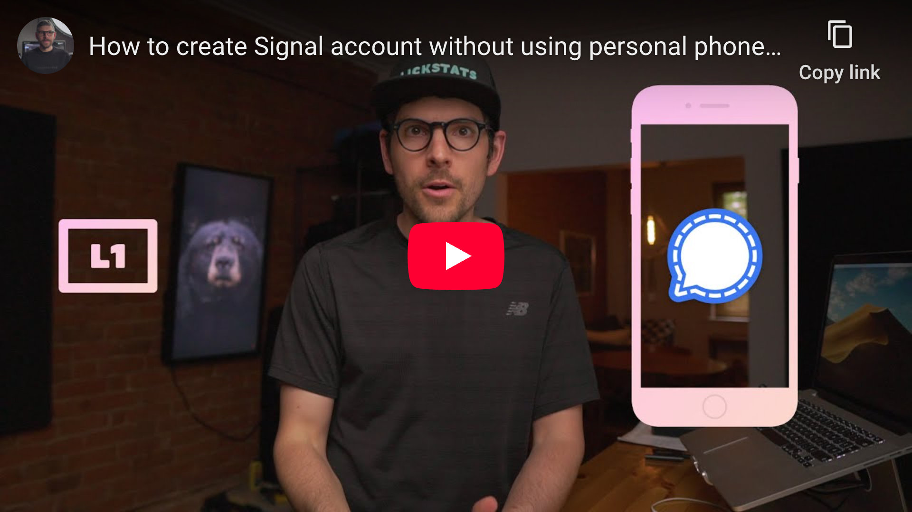

# youtube-player-screenshot

## Capture YouTube player screenshot and, optionally, generate markdown code for it.

This project was developed to make embedding what appears to be clickable YouTube players (like the one bellow) effortless and scriptable.

[](https://www.youtube.com/watch?v=b9aMJZjZ4pw "How to create Signal account without using personal phone number - YouTube")

## Features

- Super simple to use
- Uses trusted dependencies ([chalk](https://www.npmjs.com/package/chalk), [clipboardy](https://www.npmjs.com/package/clipboardy), [puppeteer](https://www.npmjs.com/package/puppeteer), etc...)
- Very light codebase to audit (less than 100 lines)
- Written in TypeScript

## Installation

```shell
npm install youtube-player-screenshot -g
```

## Usage

```console
$ cd /Users/sunknudsen/Desktop

$ youtube-player-screenshot -h
Usage: youtube-player-screenshot [options]

Options:
  --url <url>        YouTube URL
  --width <width>    screenshot width (default: "1920")
  --height <height>  screenshot height (default: "1080")
  --output <output>  output folder (default: "/Users/sunknudsen/Desktop")
  --privacy          use privacy-enhanced mode
  --clipboard        copy markdown to clipboard
  --stdout           output markdown to stdout
  -h, --help         display help for command
```

`--output` defaults to folder in which `youtube-player-screenshot` is executed.

## Example

```console
$ cd /Users/sunknudsen/Desktop

$ youtube-player-screenshot --url "https://www.youtube.com/watch?v=b9aMJZjZ4pw" --privacy --clipboard --stdout
[](https://www.youtube.com/watch?v=b9aMJZjZ4pw "How to create Signal account without using personal phone number - YouTube")
```

Markdown copied to clipboard 👍

```console
$ file how-to-create-signal-account-without-using-personal-phone-number.png
how-to-create-signal-account-without-using-personal-phone-number.png: PNG image data, 1920 x 1080, 8-bit/color RGBA, non-interlaced
```
